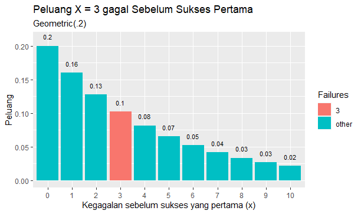
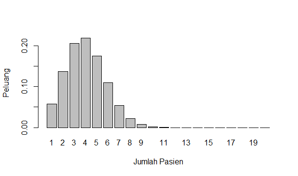
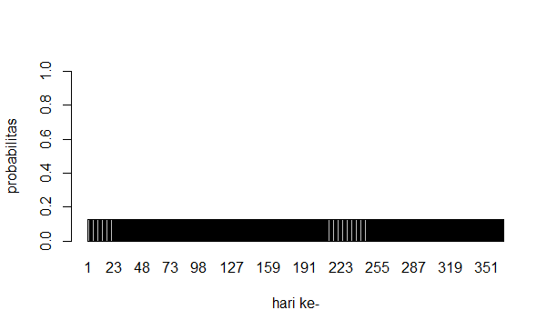
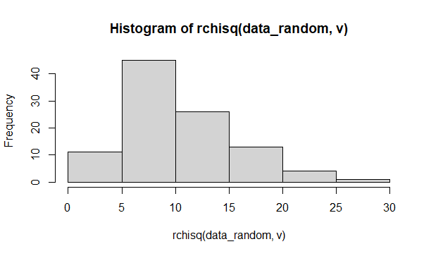
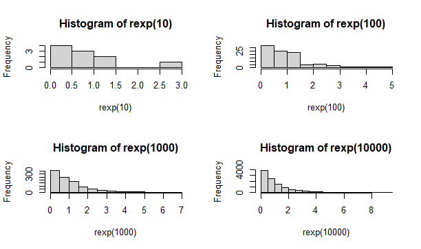
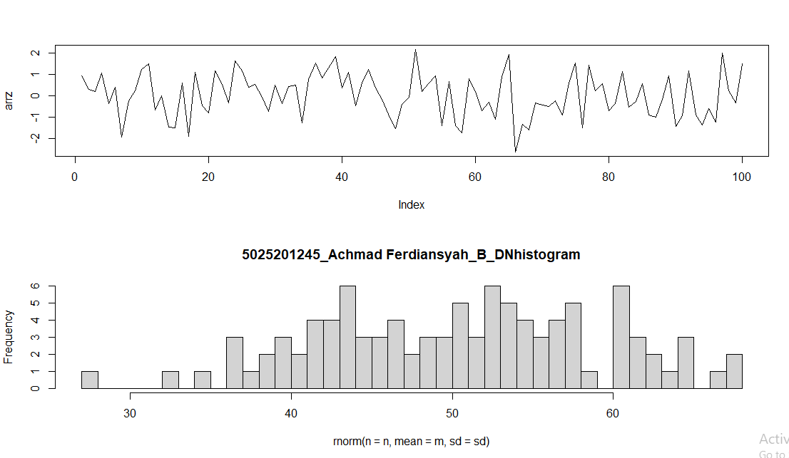

---

<p align="center" > Achmad Ferdiansyah - 5025201245
    <br> 
</p>

## Soal 1

Seorang penyurvei secara acak memilih orang-orang di jalan sampai dia bertemu dengan
seseorang yang menghadiri acara vaksinasi sebelumnya.

- Berapa peluang penyurvei bertemu x = 3 orang yang tidak menghadiri acara vaksinasi
  sebelum keberhasilan pertama ketika p = 0,20 dari populasi menghadiri acara vaksinasi ?
  (distribusi Geometrik)

```
#1a
dgeom(x = 3, prob = 0.20)
```

- mean Distribusi Geometrik dengan 10000 data random , prob = 0,20 dimana distribusi
  geometrik acak tersebut X = 3 ( distribusi geometrik acak () == 3 )

```
#1b
mean(rgeom(n = 10000, prob = 0.20) == 3)
```

- Bandingkan Hasil poin a dan b , apa kesimpulan yang bisa didapatkan?
  <br/>
  jwb: Hasil dari kedua perhitungan tidak berbeda jauh, perbedaannya yaitu pada a nilainya tetap dan b random. Faktor yang mempengaruhi besar kecilnya nilai adalah X

- Histogram Distribusi Geometrik , Peluang X = 3 gagal Sebelum Sukses Pertama

```
#1d histogram
data.frame(x = 0:10, prob = dgeom(x = 0:10, prob = 0.20)) %>%
  mutate(Failures = ifelse(x == 3, 3, "other")) %>%
  ggplot(aes(x = factor(x), y = prob, fill = Failures)) +
  geom_col() +
  geom_text(
    aes(label = round(prob,2), y = prob + 0.01),
    position = position_dodge(0.9),
    size = 3,
    vjust = 0
  ) +
  labs(title = "Peluang X = 3 gagal Sebelum Sukses Pertama",
       subtitle = "Geometric(.2)",
       x = "Kegagalan sebelum sukses yang pertama (x)",
       y = "Peluang")
```



- Nilai Rataan (μ) dan Varian (σ²) dari Distribusi Geometrik.

```
#1e nilai rataan dan varian
rataan <- 1/0.20
paste("Rataan distribusi geometrik: ", rataan)
varian <- (1-0.20) / (0.20)^2
paste("varian distribusi geometrik: ", varian)
```

## Soal 2

Terdapat 20 pasien menderita Covid19 dengan peluang sembuh sebesar 0.2.

```
n = 20
ps = 0.2
q = 1 - ps
```

Tentukan :

- Peluang terdapat 4 pasien yang sembuh

```
#2a
pasien_sembuh = 4
dbinom(pasien_sembuh, n, ps)
```

- Gambarkan grafik histogram berdasarkan kasus tersebut.

```
#2b histogram
peluang <- dbinom(1:20, 20, 0.2)
data = data.frame(y=c(peluang), x=c(1:20))
barplot(data$y, names.arg=data$x, ylab="Peluang", xlab="Jumlah Pasien")
```



- Nilai Rataan (μ) dan Varian ( ) dari σ² Distribusi Binomial.

```
#2c rataan dan varian
rataan = pasien_sembuh * ps
cat("rataan: ", rataan, "\n")
varian = pasien_sembuh * ps * q
cat("varian: ", varian, "\n")
```

## soal 3

Diketahui data dari sebuah tempat bersalin di rumah sakit tertentu menunjukkan rata-rata historis
4,5 bayi lahir di rumah sakit ini setiap hari. (gunakan Distribusi Poisson)

```
#NOMOR 3
rata_lahir = 4.5
```

- Berapa peluang bahwa 6 bayi akan lahir di rumah sakit ini besok?

```
#3a
jumlah_lahir = 6
dpois(jumlah_lahir, rata_lahir)
```

- simulasikan dan buatlah histogram kelahiran 6 bayi akan lahir di rumah sakit ini selama
  setahun (n = 365)

```
data = data.frame(y = c(dpois(jumlah_lahir, rata_lahir)), x = c(1:365))
barplot(data$y, names.arg = data$x, ylab = "probabilitas", xlab = "hari ke-", ylim = 0:1)
```



- bandingkan hasil poin a dan b , Apa kesimpulan yang bisa didapatkan <br/>
  jwb: dari perhitungan yan didapat, baik a maupun b menghasilkan hasil yang sama dari hari pertama hingga hari terakhir.

- Nilai Rataan (μ) dan Varian ( σ² ) dari Distribusi Poisson.

```
#3d rataan dan varian lambda = rata_lahir
rataan = rata_lahir
varian = rata_lahir
rataan
varian
#varian dan rataan sama
```

## Soal 4

Diketahui nilai x = 2 dan v = 10.

```
#4
x = 2
v = 10
```

Tentukan:

- Fungsi Probabilitas dari Distribusi Chi-Square.

```
#4a
dchisq(x, v)
```

- Histogram dari Distribusi Chi-Square dengan 100 data random.

```
#4b
data_random = 100
hist(rchisq(data_random, v))
```

 

- Nilai Rataan (μ) dan Varian ( σ² ) dari Distribusi Chi-Square.

```
#4c
rataan = v
varian = 2 * v
rataan
varian
```

## Soal 5

Diketahui bilangan acak (random variable) berdistribusi exponential (λ = 3).

```
#NOMOR 5
lambda = 3
```

Tentukan:

- Fungsi Probabilitas dari Distribusi Exponensial

```
#5a
dexp(lambda)
```

- Histogram dari Distribusi Exponensial untuk 10, 100, 1000 dan 10000 bilangan random

```
#5b Histogram
par(mfrow = c(2,2))
set.seed(1)
hist(rexp(10))
set.seed(1)
hist(rexp(100))
set.seed(1)
hist(rexp(1000))
set.seed(1)
hist(rexp(10000))
```



- Nilai Rataan (μ) dan Varian ( σ² ) dari Distribusi Exponensial untuk n = 100 dan λ = 3.

```
#5c
rataan = lambda
varian = lambda^2
```

## Soal 6

iketahui generate random nilai sebanyak 100 data, mean = 50, sd = 8.

```
#6
n = 100
m = 50
sd = 8
x1 = 0
x2 = 0
```

Tentukan:

- Fungsi Probabilitas dari Distribusi Normal P(X1 ≤ x ≤ X2), hitung Z-Score Nya dan plot
  data generate randomnya dalam bentuk grafik.
  <br/>
  Petunjuk(gunakan fungsi plot()).
  <br/>
  Keterangan : <br/>
  X1 = Dibawah rata-rata
  <br/>
  X2 = Diatas rata-rata
  <br/>
  Contoh data : 1,2,4,2,6,3,10,11,5,3,6,8
  <br/>
  rata-rata = 5.083333
  <br/>
  X1 = 5
  <br/>
  X2 = 6

```
#6a
par(mfrow = c(2,1))
data = rnorm(n=n, mean=m, sd=sd)
arrz = c()

for(i in data)
{
  z = (i - m)/sd
  arrz = append(arrz, z)

  if(i < m)
  {
    x1 = x1 + 1
  }

  else
  {
    x2 = x2 + 1
  }
}


result = plot(arrz, type='l')

paste("Rata-rata: ", m)
paste("x1: ", x1)
paste("x2: ", x2)

```

- Generate Histogram dari Distribusi Normal dengan breaks 50 dan format penamaan:
  NRP*Nama_Probstat*{Nama Kelas}\_DNhistogram

```
#6b histogram
hist(rnorm(n = n, mean = m, sd = sd), breaks = 50, main="5025201245_Achmad Ferdiansyah_B_DNhistogram")
```



- Nilai Varian ( ) dari hasil generate random nilai σ² Distribusi Normal.

```
#6c
varian = sd^2
```

<br/>

## ✍️ Authors

### Achmad Ferdiansyah - 5025201245
